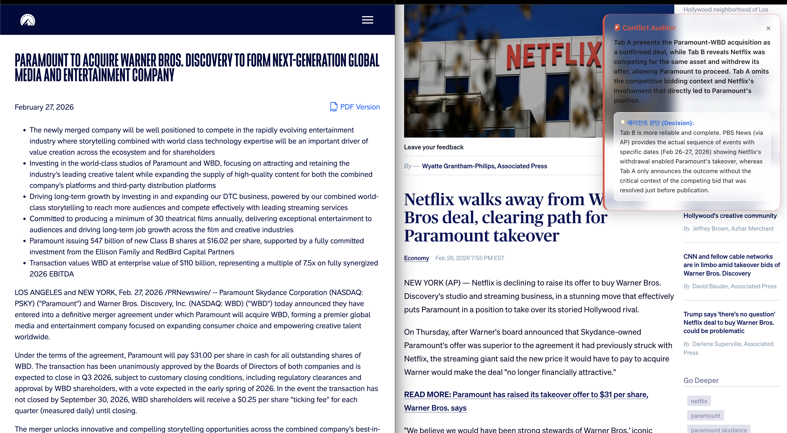

# 🚀 Synthesis Agent

**A Chrome Extension that detects information conflicts in real-time while you browse.**



Synthesis Agent is a proactive research companion that monitors your browser tabs in the background and alerts you to information conflicts using a hybrid AI architecture.

## ✨ Key Features
**Proactive Monitoring**: Automatically tracks and analyzes the content of your active tabs to maintain research context.
**Consistency Auditor**: Acts as a control plane to identify inconsistencies across sources and judges truth based on reliability and timeliness.
**Glass HUD (Heads-Up Display)**: Displays alerts and insights through a sleek, transparent Glassmorphism sidebar that doesn't interrupt your workflow.
**Hybrid Architecture**: Low-resource tasks run locally on **Apple M4** for privacy, while high-resource reasoning is routed to **Claude 4.5** for high-fidelity analysis.

## Stack
- Chrome Extension (Manifest V3, Glass UI)
- FastAPI (Python)
- Claude 4.5 (Anthropic)
- ChromaDB (Local)

## 🚀 Getting Started

### 1. Run the Server
```bash
# Navigate to the project folder
cd synthesis-agent

# Setup virtual environment & install packages
python3 -m venv venv
source venv/bin/activate
pip install fastapi uvicorn chromadb anthropic python-dotenv langchain-text-splitters

# Set your API Key in a .env file
echo 'ANTHROPIC_API_KEY="your_api_key_here"' > .env

```

### 2. Start the server
uvicorn main:app --reload

### 3. Install the Chrome Extension
Open Chrome and go to chrome://extensions/.
Enable Developer mode (top right).
Click Load unpacked and select the synthesis-agent folder.
